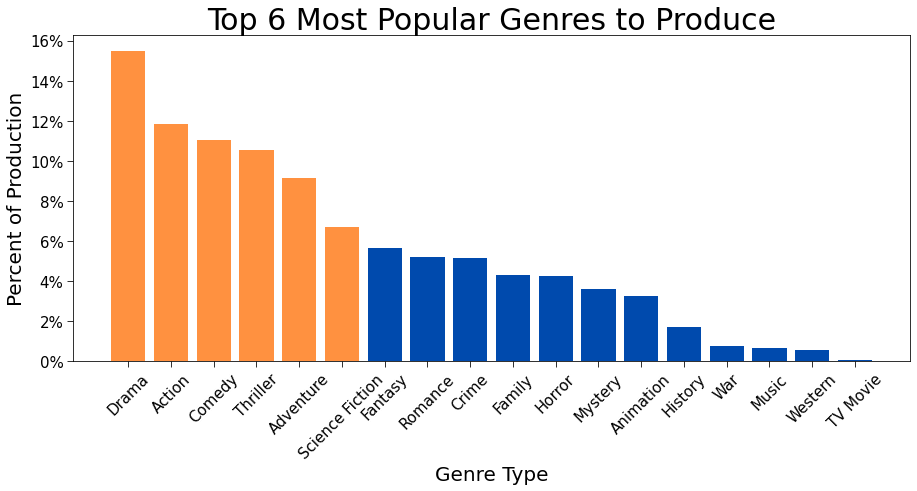

# Movie Analysis Project
**Authors:** Connor McClain & Cooper McCombs

## Repository Contents
- [Connor's Notebook](https://github.com/Co-nn/Movie-Analysis-Project/tree/main/Connor/Untitled.ipynb)
- [Cooper's Notebook](https://github.com/Co-nn/Movie-Analysis-Project/tree/main/Cooper/Movie%20Analysis.ipynb)
- [Final Notebook](https://github.com/Co-nn/Movie-Analysis-Project/blob/main/Main.ipynb)
- [Graphs](https://github.com/Co-nn/Movie-Analysis-Project/tree/main/Graphs)
## Table of Contents
- [Overview](#overview)
- [Business Problem](#business-problem)
- [Data](#data)
- [Results](#results)
- [Conclusion](#conclusion)
- [Future Work](#future-work)
- [For More Information](#for-more-information)
## Overview
The movie business is a multibillion dollar industry that estimated to have made roughly [36.8 billion](https://www.forbes.com/sites/bradadgate/2022/03/17/overview-of-the-entertainment-market-in-2021-coming-out-of-covid-19/?sh=2464a93a519c) as of 2021. On average, movies made in the U.S tend to make around [373.2 million worldwide](https://stephenfollows.com/how-movies-make-money-hollywood-blockbusters/#:~:text=The%20average%20movie%20in%20my,office%20gross%20of%20%24373.2%20million.). While money is important, popularity and ratings are what sustain a business. If a company is popular, money will follow. Using Python, we extracted data from movie websites to produce models on what makes movies well-liked among the public. Sorting the data by genre, we were able to showcase the most popular genres and their characteristics. 

## Business Problem
Microsoft is planning on creating a movie company and needs help to figure out what kinds of films they should produce. Using the data we found from IMDB (Internet Movie Database), TMDB (The Movie Database), and The Numbers website, we explored what types of movies were the most important to make. Then, proceeded to implement this data into graphs that conveyed the important traits of an average film. With this, we are able to portray to Microsoft that they should focus on popularity rather than profit.

## Data
 For this project, we used various sources of information to extract data that would represent my solution to Microsoft's problem. Then, we allocated this information on to different pandas dataframes based on its source. Not all data is clean and ready to go from the start. We had to remove all null values that would affect our models as well as clean through the columns of strings that we wanted to turn into integers (example: Production Budget). Our models correlated four different aspects of our solution for Microsoft: Genre based on highest average rating, genre based on highest average production budget, genre based on the ratio of the amount of movies already in that genre, and average runtime for each popular genre.

## Results
This graph represents the relationship between genre type and vote count score, showing the six most popular genres. The popular genres are colored orange to show that they are different from the other genres and are used in all the graphs.

This graph represents the average production budget of the six most popular genres.

This graph represents the amount of movies produced in each genre by percent.

This graph represents the average runtime of each of the genres in popular genres.
.png)

## Conclusion
From our data we were able to conclude:
- The top six most popular genres are: Action, Adventure, Comedy, Drama, Thriller, and Science Fiction
- That 67% of all movies Microsoft should produce should be at least one of the popular genres from above.
- Each movie should cost on average between $40 million and $140 million depending on the genre
- Each movie should be on average between 85 to 100 minutes long depending on the genre

These models give insight into how Microsoft should format their movies. By giving them the most popular genres and their average characteristics, Microsoft will be able to pick a genre and know how much it should cost, the frequency at which to make those movies, and around what runtime it should be.
## Future Work
We ran out of time, but some ideas we had to further our solution were:
- Comparing the popularity of adult rated movies to kid rated movies
- What are the best actors to use based on the genre of the movie
- What are the best directors based on the genre of the movie
comparing the popularity of a series of movies to a stand along movie
- Whether animated or real life films are more popular based on genre
## For More Information
- [Slide Presentation](https://github.com/Co-nn/Movie-Analysis-Project/blob/main/Cooper%20McCombs%20and%20Connor%20McClain.pdf)
- [Internet Movie Database (IMDB)](https://www.imdb.com/)
- [The Movie Database (TMDB)](https://www.themoviedb.org/?language=en-US)
- [The Numbers (TN)](https://www.the-numbers.com/)
- [How to Insert Hyperlinks](https://www.youtube.com/watch?v=tYtPOq3AkmM)
 
## Repo Map
```
├── Connor                                           <- Rough Working Directory
|   ├── Graphs                                       <- Rough Graphs
|   └── Untitled.ipynb                               <- Rough Jupyter Notebook
├── Cooper                                           <- Rough Working Directory
|   └── Movie Analysis.ipynd                         <- Rough Jupyter Notebook
├── Graphs                                           <- Final Graphs        
|   ├── Average_Budget_Cost_per_Genre.png            <- Comparison between Average Production Budget and Genre
|   ├── Budget_Cost_per_Average_Vote.png             <- Correlation between Popularity and Production Budget
|   ├── Correlation_Between_Budget_and_Gross.png     <- Correlation between Production Budget and Worldwide Gross
|   ├── Genres_by_Average_Runtime(minutes).png       <- Comparison between Average Runtime(minutes) and Genre
|   ├── Top_6_Most_Popular_Genres_to_Produce.png     <- Comparison between Percent of Production and Genre
|   └── VoteCountScore.png                           <- Comparison between Vote Count Score and Genre
├── .gitignore                                       <- Standard python gitignore file
├── Cooper McCombs and Connor McClain.pdf            <- Final Slides Presentation
├── Main.ipynb                                       <- Final Jupyter Notebook
└── README.md                                        <- You Are Here   X
```
